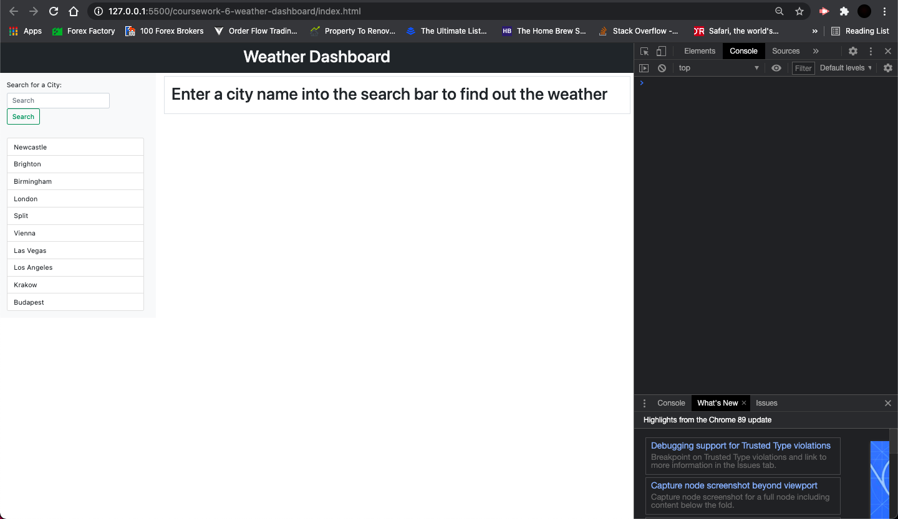
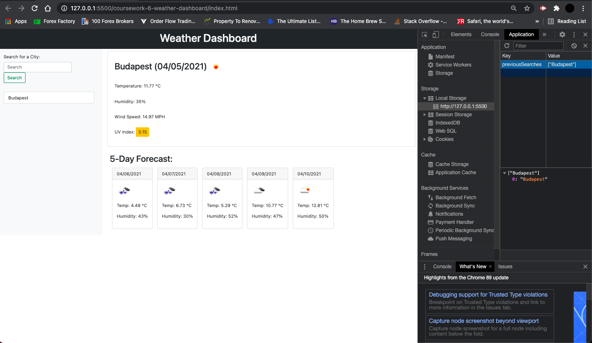
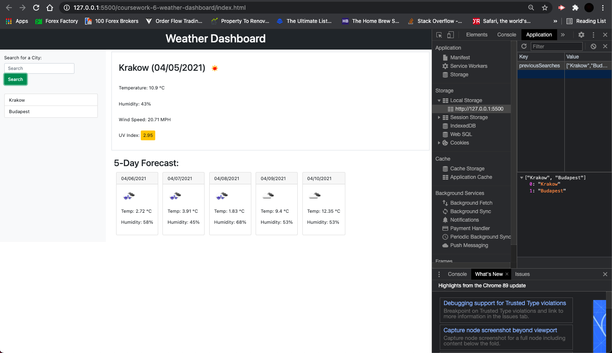
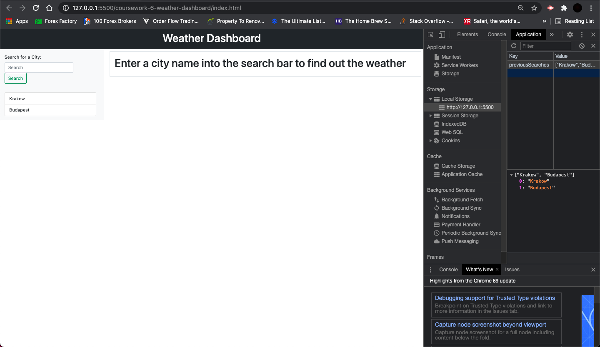
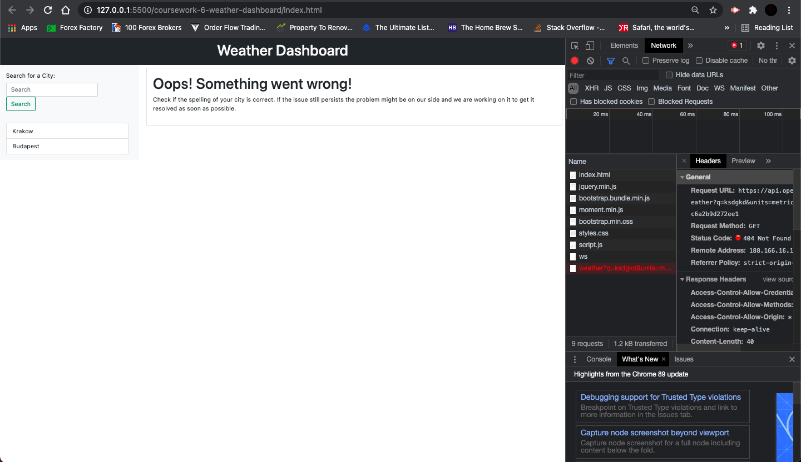

# Weather Dashboard

## Description

In this project I have used the openweathermap API to allow the user to search for the current weather of a city and the next 5 day's forecast. The last 10 searched city is stored in local memory and rendered onto the page on load.

## What I have done

- [x] Added asynchronous JS functions for server request including error handling on server error
- [x] Added logic so that cards from previous searches are rendered dynamically from local storage on page load
- [x] Added logic to only add city to the previous searches tab if it doesn't already exist and only keep the last 10 searches
- [x] Added function to dynamically render current weather section using data from the server and template strings in jQuery
- [x] Added function to dynamically render following 5 days' forecast using server data and template strings in jQuery
- [x] Date formatted with Moment.js
- [x] Added event listener to the search form to run main function when user pressed search button

## Link to Github repository

https://github.com/ivnkris/weather-dashboard

## Link to deployed application

https://ivnkris.github.io/weather-dashboard/

## Screenshots

